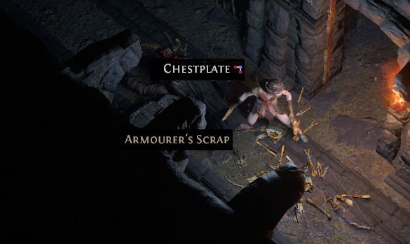
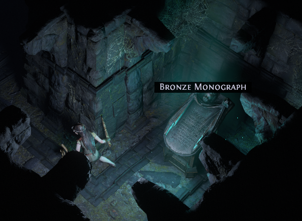
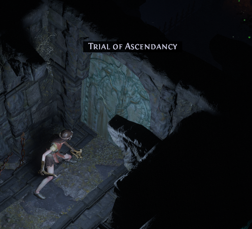

# Act 1

<h3>{{ site.data.nav.docs_list_title }}</h3>
<ul>
   
      <li><a href="{{ item.url }}">{{ item.title }}</a></li>
   
</ul>

# Which skill to use?
It's common that whatever the skills setup in the "finished" build will not be the skills you use while leveling up, at least not right away. 

One obvious reason being you don't have access to all the skill gems at level 1. 

Another example from the [Righteous Fire](https://pathofexile.gamepedia.com/Righteous_Fire) build I'm using, the skill says:
> Righteous Fire is a spell that applies a buff on the player, rapidly burning _**the player**_ and nearby enemies. The damage it deals scales with your Life and Energy Shield amount. 

It takes some setup to make it work without burning yourself down. 

Some noob friendly guides will tell you what exactly to use while leveling, like the one I'm following. Others are a bit more lenient and obvious. 

## It's okay to use "basic" skills
It's fine sticking with your starting skills, like Fireball. They could carry you a long way. Most of them do damage, simple and clear, much harder to use them wrong. 

If you want to try something different, read guides like [this](https://www.poe-vault.com/guides/beginner-leveling-guide-for-path-of-exile#leveling-builds-vs-build-guides) for more leveling skill choices. 

## But don't be afraid to try different skills
As long as you stick to the correct passive tree path, your build will come along eventually. Before that you are free to experiment with anything you like. Remember: no death penalty at all until Act 6. 

Some examples: 

- Link [Summon Phantasm Support](https://pathofexile.gamepedia.com/Summon_Phantasm_Support) to your primary damage skill, you will get some free pets to help you tank and clean up. 
- Get some mobility skills like [Frostblink](https://pathofexile.gamepedia.com/Frostblink), help you get around faster and escape stick situations. 

# Looting: What to keep?
To be fair looting is not stragithfoward in PoE. We will come back to this later. For now, just keep scrolls (wisdom and portal), and [currencies](https://pathofexile.gamepedia.com/Currency). 

Currencies are usually little things that take up 1x1 inventory space, they have a distinct look on the ground, you will get used to them soon:

Feel free to do whatever you want with other loot for now. Sell them if you like, throw them away if for any reason you don't like them. This is the first hours of your first character, you won't be missing much. 

# What gears to use? 
To have a pleasant leveling experience, there are two obvious ways:

## Offence
Kill things faster. 

Skill setup play a big role in early game since you don't have access to good gears. __Look for gears with more sockets and links__, so that you can enhance your damaging skills with more support gems. 

If your damage skills are attack damage based (description like "Deals XXX% of Base Attack Damage"), use weapons with higher damage. 

## Defence
More health is always good. Go for more armour/evasion/energy shield depending on your class. You don't have to worry about other mechanics right now. 

If you are interested though, here are some readings:

https://exiledguides.com/home/beginner-guides/beginner-guide-series/part-6/

https://exiledguides.com/home/beginner-guides/beginner-guide-series/part-7/

# First Labyrinth Trial
You will run into special event/location/mechanics while your run through the campaign. Some of them just give you additional rewards, others are league related content. Feel free to mess around. 

But there is one system that's essential for every build: [The Labyrinth](https://exiledguides.com/home/beginner-guides/the-labyrinth/#Introduction)

Simply put, it's a series of trap based puzzles that scatter across the campaign maps. Once you complete them, you will gain access to a special dungeon called The Labyrinth. You get "super passive skill points" (Ascendancy points) upon beating the Labyrinth, which will greatly shape your build. 

The first trial you will encounter is in The Lower Prison, it looks like this:

You can give it a try, they are not hard early on. Don't worry if you missed it or don't feel like doing it. You can always come back and do them later. You won't be able to complete the first Labyrinth until Act 3 anyway. 

# Min-maxing
If you are no stranger to ARPG games, you'll know that min-maxing is huge. However don't worry about optimising anything until much later. 

You will see veterans min-maxing leveling to get to end game super fast. But don't worry about doing things "correctly" or "properly" too much. If you pick up one trick or two, that's great, if you don't, it's totally fine. 

Realistically, for everything you learn to do right, there are probably a dozen of things you are doing "wrong" unknowingly. You will get there naturally as you keep playing. 

# Story
By now you would have gotten your first taste of PoE's story and lore. 

My personal opinion is that the lore is great but dense. The narrative doesn't mesh well with the hack and slash gameplay. 

It's normal if you feel lost trying to follow what's going on. You can also come back and enjoy the story later, on Youtube! 

One series I recommend is https://www.youtube.com/watch?v=loVRzJ30FzY
It's a full recap of the campaign story with detailed background and context. 

---
Now that you've taken your first steps in PoE, it's time to proceed to 
# [Act 2](act2.md)